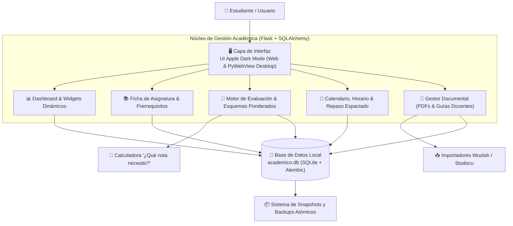

# 🎓 Gestión Académica GREELEC · UPC

[](https://www.python.org/downloads/)
[](https://flask.palletsprojects.com/)
[]()
[]()
[]()
[](LICENSE)

> **Suite integral de ingeniería y aplicación de escritorio** para el seguimiento y gestión académica del **Grado en Ingeniería Electrónica de Telecomunicación (GREELEC · Universitat Politècnica de Catalunya)**.
> 
> Diseñada para centralizar asignaturas, expedientes, fórmulas complejas de evaluación continua, cálculo automático de notas necesarias, calendario de entregas, repositorio documental (apuntes, guías docentes, Wuolah/Studocu) y sesiones de repaso espaciado. Funciona tanto como servidor web local (`http://localhost:5000`) como aplicación de escritorio nativa e independiente (`GestionAcademicaGREELEC.exe`).

---

## 🏛️ Arquitectura del Sistema



---

## ✨ Funcionalidades Principales

### 📊 1. Dashboard Ejecutivo y Widgets Personalizables
- **Visión Global del Cuatrimestre:** Métricas clave en tiempo real: créditos superados, media simple y ponderada por ECTS, media por cuatrimestre, progreso del cuatrimestre actual y alertas de entregas inminentes.
- **Objetivo de Media:** Fija una nota objetivo y la app calcula qué media necesitas en las ECTS que te quedan.
- **Temporizador de Estudio:** Sesiones cronometradas por asignatura que suman a la racha de estudio y a un resumen de minutos de hoy y de la semana.
- **Widgets Reordenables:** Acceso directo a notas rápidas, próximas evaluaciones, materias activas y accesos directos al Campus Virtual (Atenea / Moodle).
- **Buscador Global Instantáneo:** Localiza asignaturas, apuntes, conceptos, temas o profesores en milisegundos con un atajo de teclado.

---

### 🧮 2. Motor Avanzado de Evaluación y Calculadora de Notas
- **Soporte para Múltiples Esquemas de Evaluación:** Configura fórmulas alternativas de evaluación (ej. *Opción A: Evaluación continua con parciales* vs. *Opción B: 100% examen final*). La aplicación calcula y selecciona automáticamente la mejor nota para el alumno.
- **Calculadora "¿Qué nota necesito?":** Indica exactamente qué calificación mínima debes obtener en las entregas restantes o en el examen final para alcanzar tu objetivo (Aprobado 5.0, Notable 7.0, Sobresaliente 9.0).
- **Desglose de Componentes:** Ponderación flexible de teoría, prácticas de laboratorio, proyectos, exámenes parciales y finales, editable y reordenable, con aviso si los pesos no suman 100 %.
- **Bloques de Evaluación (nota jerárquica):** Un grupo como *Laboratorio 40 %* calcula su propia nota a partir de sus prácticas y controles, tal como lo definen las guías docentes de la UPC. La importación desde la guía en PDF los propone automáticamente.
- **Nota Mínima por Componente:** Si un examen exige un 4, la asignatura cuenta como suspendida aunque la media llegue a 5.
- **Duplicar Esquemas:** Copia la estructura sin notas para probar una fórmula alternativa.

---

### 📚 3. Estructura del Grado, Prerrequisitos y Optativas
- **Árbol Académico Completo:** Organización de los 4 años y 8 cuatrimestres de GREELEC con estados visuales (`superada`, `cursando`, `pendiente`, `no_elegida`).
- **Control de Prerrequisitos:** Validación cruzada de dependencias académicas para matricular asignaturas posteriores.
- **Catálogo de Optativas:** Planificación y simulación de itinerarios de optatividad con cálculo del cómputo total de créditos ECTS.

---

### 👨‍🏫 4. Directorio Docente y Comunicación
- **Ficha del Profesorado:** Registro detallado de profesores por asignatura (teoría, laboratorio, responsable de grupo).
- **Acceso Rápido:** Botones de un solo clic para redactar correo electrónico corporativo o acceder a la sala de tutorías online.

---

### 📂 5. Repositorio Documental y Guías Docentes
- **Organización Centralizada:** Almacén estructurado por asignatura de diapositivas, enunciados de problemas, boletines de laboratorio y exámenes resueltos.
- **Importadores Integrados:** Scripts de procesamiento e importación automática de material descargado de **Wuolah** y **Studocu**, eliminando duplicados y renombrando archivos con nomenclatura estándar.
- **Guías Docentes Oficiales:** Almacena y consulta las guías de cada curso con competencias y bibliografía recomendada.

---

### 🧠 6. Calendario de Exámenes y Repaso Espaciado
- **Agenda Temporal:** Calendario mensual, semanal y en agenda con fechas clave de parciales, entregas de prácticas y fechas límite. Las tareas se pueden repetir cada semana, posponer y marcar como hechas desde la campanita de avisos.
- **Importar desde Atenea:** Carga el `.ics` exportado del calendario de Atenea/Moodle con previsualización, asignatura sugerida y recordatorio automático.
- **Impresión:** Horario, calendario y "Esta semana" se pueden imprimir en papel.
- **Sistema de Repaso Espaciado (SRS):** Tarjetas de preguntas clave con intervalos de repaso basados en algoritmos de memoria para consolidar conceptos antes de los exámenes.

---

### 🔒 7. Seguridad y Control de Acceso Local
- **Bloqueo Opcional con Clave (`GREELEC_LOCK_KEY`):** Protege la interfaz con contraseña al utilizar el ordenador en redes Wi-Fi públicas o bibliotecas universitarias.
- **Backups Automáticos y Exportación en ZIP:** Copia de seguridad en un solo clic de la base de datos y toda la biblioteca de documentos. El expediente se puede exportar además a CSV para Excel.
- **Uso en Varios Ordenadores:** Ajustes muestra qué base de datos abre la app (ruta, fecha y huella de contenido), avisa de copias en conflicto de Syncthing y de cambios externos en disco mientras la app está abierta.

---

## 🚀 Instalación y Puesta en Marcha

### Requisitos
- **Python 3.10** o superior.
- Git.

### 1. Clonar el Repositorio
```bash
git clone https://github.com/Damaga2005/Gestion-Academica.git
cd Gestion-Academica
```

### 2. Crear y Activar Entorno Virtual
```powershell
# En Windows (PowerShell):
python -m venv venv
.\venv\Scripts\activate
```

### 3. Instalar Dependencias
```powershell
pip install -r requirements.txt
```

### 4. Inicializar y Sembrar la Base de Datos
```powershell
# Aplica las migraciones de esquema y carga los datos oficiales de GREELEC
python seed.py
```
*(Este comando es seguro e idempotente: no duplica datos existentes).*

### 5. Iniciar la Aplicación
```powershell
python app.py
```
Abre tu navegador en: **`http://localhost:5000`**

---

## 🖥️ Aplicación de Escritorio (.exe)

Puedes compilar la aplicación como un ejecutable independiente de escritorio para Windows (usando `pywebview` y `PyInstaller`):

```powershell
# Ejecutar script de empaquetado
.\build.ps1
```
El ejecutable se generará en la carpeta `dist/GestionAcademicaGREELEC.exe`.

---

## 🗄️ Gestión del Esquema de Datos (Alembic)

La base de datos SQLite se gestiona de forma declarativa con **Flask-Migrate**:

```powershell
# Definir variable de entorno
$env:FLASK_APP = "app:create_app"

# Aplicar migraciones pendientes
flask db upgrade

# Crear una nueva migración tras modificar models.py
flask db migrate -m "Detalle del cambio"

# Revertir la última migración
flask db downgrade -1
```

---

## 📁 Estructura del Repositorio

```text
gestion_academica/
├── app.py                     # Fábrica de la aplicación Flask (create_app)
├── config.py                  # Parámetros de configuración y variables de entorno
├── models.py                  # Modelos relacionales ORM de SQLAlchemy
├── seed.py                    # Script de sembrado de datos iniciales del grado
├── escritorio.py              # Lanzador nativo de ventana de escritorio (PyWebView)
├── build.ps1                  # Script de automatización de compilación a .exe
├── changelog.py               # Registro de cambios que muestra la propia app
├── routes/                    # Controladores modulares (Blueprints)
│   ├── asignaturas.py         # Fichas, prerrequisitos, optativas, medias y objetivo
│   ├── esquemas.py            # Esquemas de evaluación (crear, duplicar, regla)
│   ├── bloques.py             # Bloques de evaluación y reordenación
│   ├── componentes.py         # Componentes, notas y notas mínimas
│   ├── guia_docente.py        # Importar profesores y esquemas de la guía docente
│   ├── tareas.py              # Calendario: tareas, repetición y posponer
│   ├── importar_ics.py        # Importar tareas desde un .ics (Atenea)
│   ├── horarios.py            # Horario semanal recurrente
│   ├── estudio.py             # Temporizador de estudio
│   ├── documentos.py          # Repositorio de apuntes y archivos
│   ├── backup.py              # Backups, exportar/importar y CSV del expediente
│   └── ...                    # Notificaciones, racha, búsqueda, ajustes, etc.
├── tests/                     # Suite de pruebas (pytest)
├── templates/                 # Vistas HTML con motor Jinja2 y componentes
├── static/                    # Hojas de estilo CSS (Apple Dark), iconos y scripts JS
├── migrations/                # Historial de migraciones versionadas con Alembic
├── documentos/                # Almacén de archivos PDF y guías docentes
├── academico.db               # Base de datos local SQLite
└── FUNCIONALIDADES.md         # Documentación funcional extendida
```

---

## 📄 Licencia

Distribuido bajo la Licencia **MIT**. Consulta el archivo [LICENSE](LICENSE) para más información.

---
Grado en Ingeniería Electrónica de Telecomunicación (GREELEC) · Universitat Politècnica de Catalunya (UPC)
